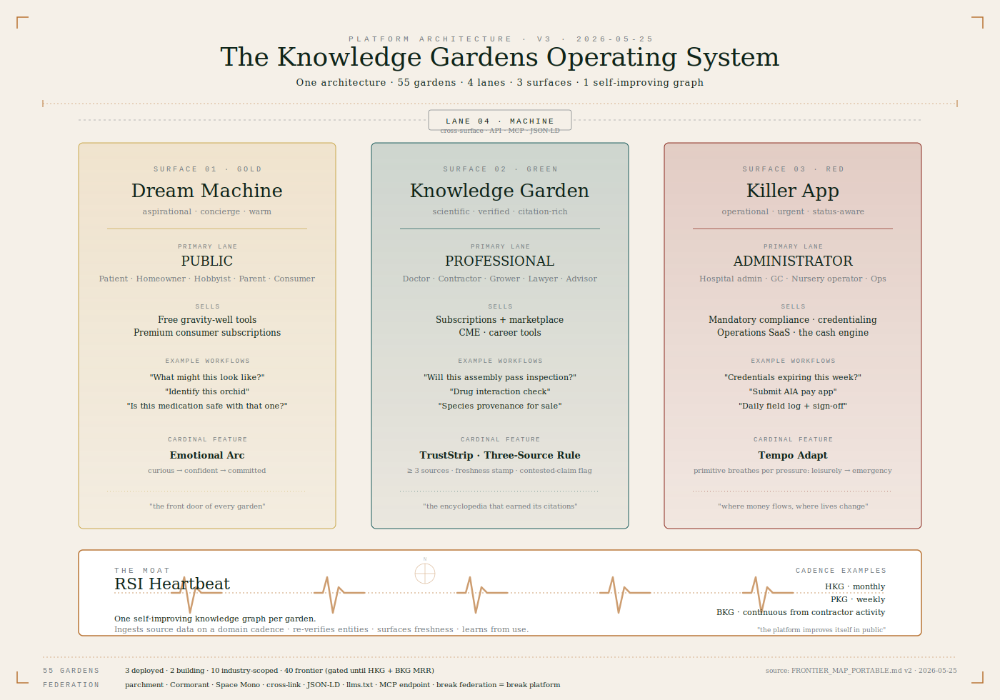

# The Knowledge Gardens OS — Strategy v3 (decisions locked)

**From:** Chilly Dahlgren
**To:** John Bou, Michael Bou
**Date:** 2026-05-25
**Status:** Decisions locked by founder. This is the working spine — not for slide deck use.
**Posture for Mike:** Pre-read; the actual review is a live Killer App walkthrough.
**Posture for John:** Engage with the text and the architecture diagram.

---

## The moat — name it first, name it everywhere

**The RSI Heartbeat is the platform.** One self-improving knowledge graph per garden, ingesting source data on a domain cadence, re-verifying every entity, surfacing freshness on every claim, learning from use. The platform doesn't hold knowledge — it improves itself in public. Every other platform in our space holds static data and ages. We get more right every week. **That is the moat in the AI era.** Put this paragraph at the top of every doc, every project instruction, every onboarding brief from this point forward.

---

## The architecture (the diagram is the strategy)

**One architecture · 55 gardens · 4 lanes · 3 surfaces · 1 self-improving graph.**

The frontier map is canonical (`FRONTIER_MAP_PORTABLE.md` v2). The OS thesis is:

- **4 lanes** at the umbrella level — Administrator (Red Killer App primary), Professional (Green Knowledge Garden primary), Public (Gold Dream Machine primary), Machine (cross-surface API · MCP · JSON-LD). Per-garden sub-lanes nest inside these four (BKG has 8 sub-lanes; OKG has 6; HKG has 5).
- **3 surfaces** at the umbrella level — Gold Dream Machine, Green Knowledge Garden, Red Killer App. Every garden manifests as one or more of these three; some gardens (BKG) ship all three.
- **1 self-improving knowledge graph** per garden, fed by the RSI Heartbeat.
- **55 gardens** in roster — 3 deployed (OKG/BKG/TKG), 2 building (HKG/MKG), 10 industry-scoped post-seed, 40 frontier across 5 tiers (Build-now / Year 2 / Years 3–5 / Civilization-scale / Consciousness frontier). Frontier gardens do not get built until HKG and BKG generate MRR.

---

## Three decisions, locked

1. **One product, one architecture, 55+ gardens.** Internal infrastructure is shared. Verticals launch on the template, partner-led where appropriate. The platform exists to make any vertical economically launchable. The moat is the OS, not the construction content.

2. **All-in on the Pattern Language extension.** Seven constitutional primitives (Invitation Card · Emotional Arc · Whisper · Time Machine · Ask Anything · Pro Toggle · Progressive Reveal) plus four platform primitives baked into the frontier map (**TrustStrip · Three-Source Rule · Federation Contract · llms.txt + JSON-LD + MCP**) plus nine dimensional renderings (Pro Toggle · Infinite Descent · Modality Mirror · Tempo Adapt · Cultural Render · Accessibility Adapt · Cross-Surface Bridge · Lifecycle Memory · Trust Posture Adapt) = **a 20-piece Pattern Language**. All in. Spec'd in 2026.

3. **All 14 dimensions of user state, addressed.** Operational mechanism is the **Stance Card** — a structured user-state shape that every primitive reads before rendering. Each of the 14 axes gets a rendering or an explicit no-op decision. Nothing left as "we'll figure it out later."

---

## The Pattern Language (20 pieces, all in)

### The 7 constitutional primitives *(existing, in the design constitution)*
Invitation Card · Emotional Arc · Whisper · Time Machine · Ask Anything · Pro Toggle · Progressive Reveal.

### The 4 platform primitives *(from the frontier map, baked into every garden)*
- **TrustStrip** — every primary claim renders with source count · last-updated stamp · contested-claim indicator. Non-optional.
- **Three-Source Rule** — every claim cites ≥ 3 sources or it doesn't render as authoritative.
- **Federation Contract** — every garden ships umbrella header + footer · parchment background · Cormorant + Space Mono · cross-links to ≥ 1 other live garden · JSON-LD on every primary entity · llms.txt at root · MCP server endpoint. Break the federation, break the platform.
- **Machine-Legible Everything** — `llms.txt` + JSON-LD on every entity page; MCP server endpoint per garden at `/api/v1/mcp` or namespaced equivalent.

### The 9 dimensional renderings *(new, proposed in v2, ratified here)*
- **Pro Toggle** — flips labels and order from human-default to pro-vocabulary. *(Lane × skill at surface level.)*
- **Infinite Descent** — variable-floor engagement depth per workflow. Floor 0 plain question → Floor N agent payload. Every user finds their floor. *(Engagement-depth × skill at workflow level.)*
- **Modality Mirror** — visual / voice / gestural / agent-API renderings of every workflow. *(Modality axis.)*
- **Tempo Adapt** — primitives breathe differently under different time pressure: leisurely → focused → urgent → emergency. *(Time-pressure axis.)*
- **Cultural Render** — language · units · jurisdiction · conventions as first-class data, not settings. *(Cultural and lingual axis.)*
- **Accessibility Adapt** — color · motor · cognitive · neurodivergent profiles operationalized, not posture only. *(Accessibility axis.)*
- **Cross-Surface Bridge** — context flows Dream → Garden → Killer App without retyping. *(Surface axis, continuity.)*
- **Lifecycle Memory** — same project, same user, multi-year horizon. Surface context across stages. *(Time-horizon axis.)*
- **Trust Posture Adapt** — platform defensiveness scales inversely with user trust. First-time visitor gets reassurance; long-term user gets shortcuts. *(Trust-posture axis.)*

### The Stance Card *(operational mechanism)*
A structured user-state snapshot — domain · surface · stage · lane · skill_signal · modality · device · tempo · emotional_signal · locale · accessibility · economic_signal · time_horizon · trust_posture. Every primitive reads it before rendering. Every agent reads it to act on behalf of the user. **The Stance Card is what "all four lanes always" means in code.**

---

## Execution priority — what happens next

### Now (this week)
- Land this v3 strategy in the BKG repo + the Knowledge Gardens umbrella project. Updated docs in both locations.
- Update all project instructions to lead with the RSI Heartbeat statement.

### Next sprint (this month) — BKG Killer App rehaul
- **Tool:** Claude Design (Anthropic's new design tool — flag below).
- **Execution model:** Cowork with parallel agents.
- **Scope:** The Red Killer App surface specifically — credentialing renewals, project pipeline, compliance alerts, GreenFlash CRM reward loop. Six Dream Machine interfaces and the cinematic intro stay as-is during this sprint.
- **Pattern Language application:** every rebuilt surface composes from the 20-piece language. Every workflow answers the four umbrella lanes' Floor 0 questions before code.
- **Brand discipline:** `02_BRANDING_AIKIDO_ADDENDUM.md` is the voice playbook. The Killer App is the only sanctioned exception to the parchment rule within BKG. GreenFlash particle effects + Web Audio chimes are preserved.

### After BKG Killer App rehaul ships
- Mirror the Pattern Language application to HKG Killer App (the cash engine).
- Apply Infinite Descent + TrustStrip + Three-Source Rule to one OKG workflow (Orchid Identification) to prove cross-domain portability.
- Begin Pattern Language template productization — the toolkit a partner uses to launch any of the 40 frontier gardens once HKG + BKG generate MRR.

---

## Claude Design — flagged for the team

Charlie flagged that Anthropic has launched a tool called Claude Design that we should use for the BKG Killer App UX rehaul. I don't have confirmed details on enablement or feature scope as of today — recommend John spends 30 minutes during the Cowork session start verifying what it is, how to enable it, and whether it's the right tool for the rehaul or whether we should use Cowork-with-parallel-agents on the existing Next.js codebase directly. Either way, the strategy doesn't change; only the tooling does.

---

## Wisdom-of-the-ages, briefly

Eight teachers underwrite this work. Christopher Alexander (Pattern Language as central metaphor) · Edward Tufte (small multiples for lane variants) · Donald Norman (affordances for every body / culture / modality) · Bret Victor (every floor is a live instrument, not a paragraph) · Frank Lloyd Wright (compression and release at architecture-of-experience scale) · Mister Rogers (look for the helpers — the platform surfaces them, never replaces them) · Toyota Lean (jidoka and poka-yoke for spec discipline) · Steve Jobs and Jony Ive (the embodied constraint — for us, the arrival stance in state space).

---

## The Equipment Schedule moment, still useful

The diagnostic that opened this whole strategy: founder dogfood pass on the live Equipment Schedule page (BKG · Plan · MEP) revealed that the page was technically correct but readable to only one of BKG's eight sub-lanes (MEP-fluent designer or GC). For the other seven, the breadcrumb "PLAN · MEP," the rule-of-thumb-vs-Manual-J disclaimer, and the ASHRAE / UPC / CBC citations were walls of jargon.

The fix isn't to redesign that one page. The fix is to apply the Pattern Language so every workflow has Floor 0 plain entry, every claim has a TrustStrip, every lane gets a Floor 0 answer, every surface composes from the 20 pieces. **Equipment Schedule v2 becomes Probe 6 of 6 in the validation set** — alongside Orchid ID, Dream "what might this look like," Code Compliance Lookup, Daily Field Log, and AIA Pay App. Six probes spanning three surfaces, four lanes, two domains, four modalities.

---

## What I'd like from John and Mike

**John** — engage with the architecture diagram and the 20-piece Pattern Language list. Mark anything you'd cut or rename. The 14 dimensions are the load-bearing claim — if any axis is wrong, the rendering set shifts.

**Mike** — pre-read only. The review is the live BKG Killer App walkthrough once the rehaul ships in Cowork. Mark which of the six workflow probes you want to walk first.

**Both** — confirm "RSI Heartbeat as the moat" lands as the lead message of every external-facing artifact from this point forward (investor decks, press, recruiting, customer onboarding). If it doesn't land that way, we re-language.

— Chilly
